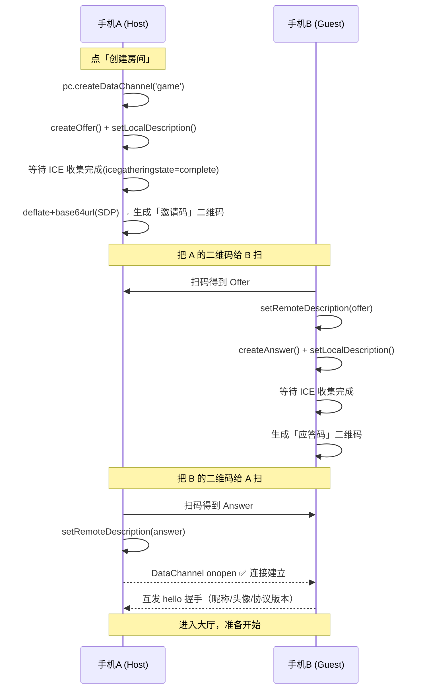
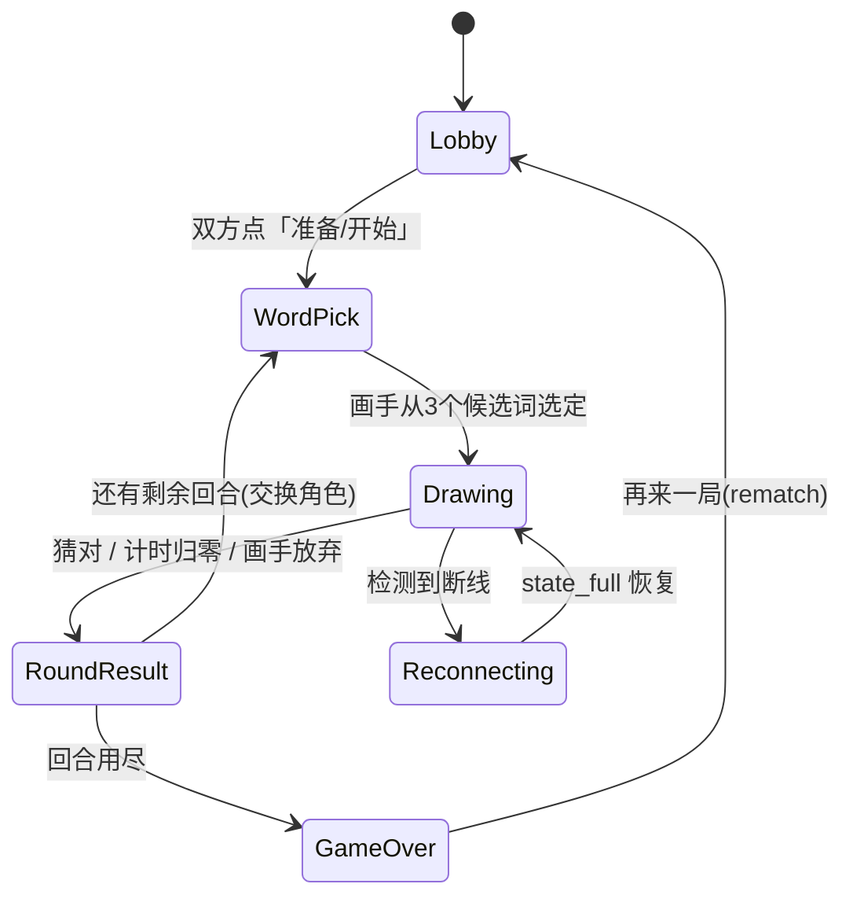

# 你画我猜 · 无服务器双人联机 · 方案文档

> 两部 Android 手机（或浏览器）**点对点直连**的「你画我猜」游戏。无任何自建后端服务器，基于 **WebRTC DataChannel + 二维码手动信令** 建立连接；使用 **React + Capacitor** 一套代码同时产出 **Web 版** 与 **Android APK**。

- 文档版本：v1.0
- 目标功能档位：**完整版**（核心玩法 + 断线重连 + 多难度词库 + 快捷表情/提示 + 音效与主题）
- 适用读者：开发者（按本文档分阶段实现）

---

## 目录

1. [项目概述](#1-项目概述)
2. [技术选型](#2-技术选型)
3. [系统架构与连接原理](#3-系统架构与连接原理)
4. [通信协议设计](#4-通信协议设计)
5. [游戏玩法与功能设计](#5-游戏玩法与功能设计)
6. [UI 设计](#6-ui-设计)
7. [状态管理设计](#7-状态管理设计)
8. [项目目录结构](#8-项目目录结构)
9. [开发里程碑（分阶段）](#9-开发里程碑分阶段)
10. [Android 打包流程](#10-android-打包流程)
11. [风险与对策](#11-风险与对策)
12. [后续可扩展方向](#12-后续可扩展方向)
13. [开发进度与变更记录](#13-开发进度与变更记录)

---

## 1. 项目概述

### 1.1 一句话定义
两人各拿一部手机，**不需要联网到任何服务器**，通过互相扫一次二维码即可建立 P2P 连接，轮流「画」与「猜」。

### 1.2 核心特性
- **真·无服务器**：不部署任何后端，连信令都靠二维码手动交换。
- **跨平台一套码**：React Web 代码 → Capacitor 套壳 → Android APK；浏览器直接可玩。
- **就近直连**：同一 WiFi 下走局域网直连，延迟极低；跨网络可借助免费公共 STUN 打洞。
- **完整玩法闭环**：词库选词 → 画图 → 实时猜词 → 计时计分 → 回合结算 → 总分胜负 → 再来一局。
- **健壮性**：断线检测、重连恢复、状态全量同步。

### 1.3 平台矩阵
| 平台 | 运行形态 | 说明 |
|---|---|---|
| Android | APK（Capacitor WebView） | 主目标，支持相机扫码、震动反馈、状态持久化 |
| Web | 浏览器（PWA 可选） | 同代码直接 `vite build`，方便调试与分享 |

### 1.4 约束与边界
- 首版只支持 **2 人对战**（1 画 1 猜，每回合交换角色）。3 人及以上属后续扩展。
- 无服务器意味着 **没有匹配大厅 / 排行榜 / 账号体系**；联机靠二维码当面或截图分享。
- 跨公网在「对称型 NAT」下可能打洞失败（详见 [§11](#11-风险与对策)），同一 WiFi 场景不受影响。

---

## 2. 技术选型

### 2.1 总览
| 领域 | 选型 | 理由 |
|---|---|---|
| 框架 | **React 18 + TypeScript** | 生态成熟，组件化适合多界面状态切换 |
| 构建 | **Vite** | 启动快、HMR 顺滑、Capacitor 集成简单 |
| 移动端打包 | **Capacitor 6** | Web 代码零改动套壳成 APK，按需调用原生能力 |
| P2P 传输 | **WebRTC `RTCDataChannel`** | 浏览器/WebView 原生支持，可靠有序通道，无需后端中转 |
| 信令 | **二维码（手动）** | `qrcode` 生成 + `@zxing/browser` 扫描，彻底去服务器化 |
| 信令压缩 | **pako（deflate）** | 压缩 SDP 体积，保证能塞进单张二维码 |
| 状态管理 | **Zustand** | 轻量、无样板代码、适合游戏状态与连接状态分层 |
| 样式 | **Tailwind CSS + 自定义 Clay 工具类** | 快速实现黏土拟物风（见 [§6](#6-ui-设计)） |
| 绘图 | **Canvas 2D**（可选 `perfect-freehand` 平滑笔触） | 性能足够，无依赖；增量笔画易序列化同步 |
| 动效 | **Framer Motion** | 弹跳/入场等趣味微交互 |
| 图标 | **lucide-react** | 纯 SVG 图标，避免用 emoji 当图标 |
| 音效 | **Howler.js**（或原生 Audio） | 短音效播放、预加载、静音控制 |
| 工具 | **nanoid**（ID）、**clsx**（类名） | — |

### 2.2 npm 依赖清单（建议）
```jsonc
// 运行时
"react", "react-dom",
"zustand",
"qrcode",            // 生成二维码
"@zxing/browser",    // 摄像头扫码（Web 与 Android WebView 通用，走 getUserMedia）
"pako",              // SDP 压缩
"framer-motion",
"lucide-react",
"howler",
"nanoid",
"clsx",

// Capacitor
"@capacitor/core", "@capacitor/android",
"@capacitor/app",          // 安卓返回键
"@capacitor/status-bar",
"@capacitor/haptics",      // 猜对/计时震动反馈
"@capacitor/preferences",  // 持久化设置 & 断线恢复用的游戏状态

// 开发时
"vite", "@vitejs/plugin-react", "typescript",
"tailwindcss", "postcss", "autoprefixer",
"@capacitor/cli"
```

> **关键点：扫码无需原生插件。** `@zxing/browser` 通过 `getUserMedia` 调摄像头，在浏览器与 Android WebView 中均可工作，只需声明相机权限。这样 Web 与 Android 共用同一套扫码代码。

---

## 3. 系统架构与连接原理

### 3.1 整体架构
```
┌─────────────── 手机 A (Host / 房主) ───────────────┐      ┌─────────────── 手机 B (Guest) ────────────────┐
│  React UI 层（页面/组件）                          │      │  React UI 层                                   │
│  ─────────────────────────────────────────────    │      │  ─────────────────────────────────────────    │
│  Zustand：connStore + gameStore + uiStore          │      │  Zustand：connStore + gameStore + uiStore      │
│  ─────────────────────────────────────────────    │      │  ─────────────────────────────────────────    │
│  GameEngine（回合状态机 / 计分 / 计时）            │      │  GameEngine（镜像，输入转发）                  │
│  ─────────────────────────────────────────────    │      │  ─────────────────────────────────────────    │
│  Net 层：PeerConnection + DataChannel + 协议编解码 │      │  Net 层                                        │
└───────────────────────┬────────────────────────────┘      └────────────────────┬───────────────────────────┘
                         │                                                          │
                         │   ①二维码交换 SDP（仅建连阶段，一次性）                  │
                         │   ②WebRTC P2P DataChannel（双向实时收发 JSON 消息）      │
                         └──────────────────────────────────────────────────────────┘
                                       （可选）免费公共 STUN 仅用于 NAT 打洞
```

- **权威方（Referee）= 房主 A**：计时、计分、回合切换等"裁判逻辑"只在房主侧运算，结果广播给 B。B 只发送输入（笔画、猜词、表情）。这样两端状态不会分叉。
- 角色（画手/猜手）每回合交换，但「房主=权威」身份在整局不变。

### 3.2 为什么是"无服务器"
WebRTC 建连需要双方交换 **SDP（含网络候选 ICE）**。常规做法用一个信令服务器中转，本方案改为：**把 SDP 编码成二维码，双方各扫一次完成交换**，从而去掉信令服务器。

- **STUN**（如 `stun:stun.l.google.com:19302`）是公共免费的"问路"服务，只用于让手机得知自己的公网地址，**不中转任何游戏数据**，也无需你自建——因此仍属"无服务器"范畴。
- **不使用 TURN**（TURN 才是需要自建/付费的中继服务器）。代价：极少数对称 NAT 跨公网场景会连不上；同 WiFi 场景完全不受影响。

### 3.3 连接建立时序（两次扫码握手）


> **交互友好性设计**：每个扫码页同时具备「显示我的码」与「扫描对方码」两块区域，并提供"复制文本码"兜底（无摄像头权限时可手动粘贴）。

### 3.4 二维码体积问题与对策（务必重视）
完整 SDP（含多个 ICE 候选）通常 1–3KB，单张二维码（version 40, 纠错L, 二进制）上限约 ~1.8KB。对策按优先级：

1. **压缩**：`pako.deflateRaw(sdp)` → `base64url`，通常可压到 ~40–55%。
2. **精简候选**：同 WiFi 玩法时优先只保留 host（局域网）候选，体积骤减；公网才追加 srflx 候选。
3. **协议版本前缀**：码内容用 `dg1:` 前缀做版本与校验。
4. **兜底——分帧动态二维码**：若压缩后仍超阈值（设 1200 字节），切分为多帧，发送端**轮播多张二维码**，接收端连续扫描自动拼接（每帧带 `序号/总数/payloadId`）。

```
单帧格式：  dg1:<base64url(deflate(SDP))>
多帧格式：  dg1m:<payloadId>:<index>/<total>:<chunkBase64url>
```

### 3.5 RTCPeerConnection 关键配置
```ts
const pc = new RTCPeerConnection({
  iceServers: [{ urls: 'stun:stun.l.google.com:19302' }], // 仅打洞，可配置开关「仅局域网」模式则置空
  iceCandidatePoolSize: 2,
});
// Host 端必须在 createOffer 之前创建 DataChannel，否则 SDP 不含通道协商
const dc = pc.createDataChannel('game', { ordered: true });
```
- **手动信令无法 trickle ICE**：必须等 `pc.iceGatheringState === 'complete'`（或监听 `icecandidate` 为 null）后再读取 `pc.localDescription` 编码，确保候选已全部收集。

---

## 4. 通信协议设计

### 4.1 设计原则
- 单条消息为 **JSON 文本**，结构 `{ t: 类型, ... }`，`t` 用短字符串省流量。
- 一条 `ordered: true` 可靠通道承载全部消息（2 人场景足够，简单可靠）。绘画高频消息**批量打包**降低频次。
- 所有坐标 **归一化到 0–1**（相对画布宽高），消除两端分辨率差异。

### 4.2 消息类型定义（TypeScript）
```ts
// 协议版本，握手时校验
export const PROTOCOL_VERSION = 1;

export type Msg =
  // —— 连接 / 会话 ——
  | { t: 'hello'; ver: number; name: string; avatar: number }      // 握手自我介绍
  | { t: 'ping'; ts: number } | { t: 'pong'; ts: number }          // 心跳
  | { t: 'state_full'; snapshot: GameSnapshot }                    // 断线重连后全量同步（房主→访客）

  // —— 游戏流程（房主权威，广播给访客）——
  | { t: 'game_config'; rounds: number; drawSeconds: number; difficulty: Difficulty }
  | { t: 'round_start'; round: number; drawerId: PlayerId; wordChoices?: string[] } // 仅画手收到候选词
  | { t: 'word_selected'; wordLen: number; category: string }      // 广播词长/分类（不泄露词）
  | { t: 'timer'; remaining: number }                              // 每秒或每数秒同步一次
  | { t: 'hint'; revealed: { index: number; ch: string }[] }       // 提示：逐步揭示字符
  | { t: 'guess_result'; playerId: PlayerId; correct: boolean; text: string }
  | { t: 'round_end'; correctWord: string; deltaScores: Record<PlayerId, number>; totals: Record<PlayerId, number> }
  | { t: 'game_end'; winner: PlayerId | 'tie'; totals: Record<PlayerId, number> }
  | { t: 'rematch' }                                               // 再来一局

  // —— 玩家输入（访客→房主；或画手→对端）——
  | { t: 'choose_word'; index: number }                            // 画手选词
  | { t: 'guess'; text: string }                                   // 猜手提交猜测
  | { t: 'chat'; text: string }                                    // 文字聊天
  | { t: 'emoji'; id: number }                                     // 快捷表情

  // —— 绘画同步（画手→猜手）——
  | { t: 'stroke_start'; id: string; color: string; width: number; tool: Tool; p: Pt }
  | { t: 'stroke_points'; id: string; pts: Pt[] }                  // 批量点（每 ~50ms 或每 8 点发一次）
  | { t: 'stroke_end'; id: string }
  | { t: 'undo' }                                                  // 撤销最近一笔
  | { t: 'clear' };                                                // 清空画布

export type Pt = [number, number];           // 归一化坐标 [x, y]，0..1
export type Tool = 'pen' | 'eraser' | 'fill';
export type PlayerId = string;                // nanoid
export type Difficulty = 'easy' | 'normal' | 'hard';
```

### 4.3 绘画增量同步策略
- 画手监听 `pointerdown/move/up`，将 `move` 的点 **节流批量**（建议 50ms 或累计 8 点触发一次 `stroke_points`）。
- 猜手收到后实时 `lineTo` 渲染；每笔以 `id` 归组，便于 `undo`。
- `tool: 'fill'`（油漆桶）发送一条带种子点的消息，两端各自执行洪水填充算法，避免传整张位图。
- **重连重绘**：画手本地保存当前回合的笔画数组；`state_full` 时把笔画一并下发，猜手重放即可恢复画面。

### 4.4 心跳与断线检测
- 每 3s 发 `ping`，对端回 `pong`；连续 2 次（>8s）未收到 → 判定断线，进入「重连中」UI。
- 同时监听 `pc.oniceconnectionstatechange`：`disconnected/failed` 立即提示。
- **重连流程**：保持本地 `GameSnapshot`；引导任一方重新走"二维码握手"建新连接，连上后房主立即发 `state_full` 恢复对局（回合、分数、剩余时间、已有笔画）。

---

## 5. 游戏玩法与功能设计

### 5.1 角色与回合
- 两名玩家：每回合一人 **画手**、一人 **猜手**，**回合结束自动交换**。
- 一局默认 **6 回合**（每人画 3 次），可在设置调整 4/6/8。
- 单回合默认 **80 秒**（可调 60/80/120）。

### 5.2 回合状态机


### 5.3 词库设计（多难度）
- 内置本地词库 `words.ts`，按 **分类 + 难度** 组织，无需联网。

```ts
interface WordEntry { word: string; category: string; difficulty: Difficulty }
// 分类示例：动物 / 食物 / 生活用品 / 动作 / 自然 / 影视 / 网络热词
// 难度梯度：easy=具体名词(苹果/猫)  normal=组合词(放风筝/红绿灯)  hard=抽象/成语(画蛇添足/孤独)
```
- 选词机制：每回合给画手随机 **3 个候选**（同难度），10 秒内选 1 个，超时自动选第一个。
- 防重复：本局已出现的词不再抽。

### 5.4 计分规则
| 事件 | 猜手得分 | 画手得分 |
|---|---|---|
| 猜对 | `基础分(100) × 剩余时间比例`，向上取整，最低 20 | 固定 **+60**（成功引导） |
| 计时归零未猜对 | 0 | 0 |
| 画手提前放弃 | 0 | 0 |
- 时间越快猜对，猜手得分越高（鼓励高效）。
- 全部回合后比较总分，高者胜，平分则 `tie`。

### 5.5 词匹配判定
- 猜词标准化后比较：去空格、转小写、全角转半角、去标点。
- 完全匹配 → 正确。
- **接近提示**（可选）：编辑距离 ≤1 或拼音相同字数差 → 回 `guess_result` 但前端显示"很接近了！"（不计正确，不泄露答案）。

### 5.6 提示系统
- 画手可点「给提示」，或在剩余时间过半时房主自动揭示：
  - 第一次：显示词长与分类（`○ ○ ○`，分类：动物）。
  - 之后每隔 N 秒揭示一个随机位置的字符。
- 揭示数量上限 = `floor(词长/2)`，避免直接送答案。

### 5.7 快捷表情 / 聊天
- 猜手与画手都可发 **快捷表情**（一排预设 SVG 表情：👍/😂/🤔/❤️/🎉 等以 SVG 实现，非 emoji 字体），在对方屏幕飘出气泡动画。
- 文字聊天：猜手输入既是"猜词"也是"聊天"——所有输入进聊天流，命中答案则标记为"猜对"。画手输入仅作聊天（不能透题，可加敏感词/含答案字符过滤提示）。

### 5.8 音效与主题
- **音效**：选词、笔触、猜对（欢呼）、计时最后 10 秒滴答、回合结束、胜利。可全局静音。
- **主题**：内置 **浅色 / 深色 / 跟随系统**；可选 2–3 套配色皮肤（见 [§6.2](#62-色彩系统)）。设置持久化到 `@capacitor/preferences`。
- **触觉反馈**（Android）：猜对、倒计时结束触发 `Haptics.impact`。

### 5.9 完整版功能清单（验收用）
- [x] 二维码创建/加入房间（含多帧兜底、文本码兜底）
- [x] WebRTC P2P 双向通道
- [x] 实时画布同步（笔触/橡皮/油漆桶/撤销/清空/调色/笔宽）
- [x] 回合状态机 + 角色交换
- [x] 多难度内置词库 + 三选一选词 + 防重复
- [x] 计时（房主权威）+ 计分 + 回合/总分结算
- [x] 提示系统（词长/分类/逐字揭示）
- [x] 聊天 + 猜词命中 + "很接近"提示
- [x] 快捷表情飘屏
- [x] 心跳 + 断线检测 + 二维码重连 + 全量状态恢复
- [x] 音效 + 静音 + 主题/皮肤 + 触觉反馈
- [x] 再来一局（rematch，保留连接）

---

## 6. UI 设计

### 6.1 设计语言：Claymorphism（黏土拟物）
活泼、友好、像玩具——非常契合派对小游戏。要点：

| 维度 | 规范 |
|---|---|
| 圆角 | 卡片/按钮 16–24px，输入 14px，胶囊元素 999px |
| 边框 | 粗描边 3px（深一档的同色系）增强"实体感" |
| 阴影 | **双阴影**：外投影 + 内高光，营造软糯立体 `box-shadow: 6px 6px 16px rgba(108,92,231,.18), inset 2px 2px 6px rgba(255,255,255,.7)` |
| 按压动效 | `transform: scale(.96)` + 阴影变浅，`cubic-bezier(0.34,1.56,0.64,1)` 软回弹，200ms |
| 形态 | 大圆角、胖按钮、留白充足、元素有"厚度" |

> 字体：**标题 Fredoka（圆润粗体）/ 正文 Nunito（友好无衬线）**。
> `@import url('https://fonts.googleapis.com/css2?family=Fredoka:wght@400;500;600;700&family=Nunito:wght@300;400;500;600;700&display=swap')`

### 6.2 色彩系统
> 高对比、明快。两套模式 + 品牌主色"葡萄紫"。所有正文确保 ≥4.5:1 对比度。

**浅色模式（Light）**
| Token | Hex | 用途 |
|---|---|---|
| `--bg` | `#FAF7FF` | 页面背景（柔和薰衣草白） |
| `--surface` | `#FFFFFF` | 卡片/面板 |
| `--surface-2` | `#F2EEFC` | 次级填充/输入底 |
| `--primary` | `#6C5CE7` | 品牌主色（按钮、强调） |
| `--primary-press` | `#5847D6` | 按压态 |
| `--secondary` | `#FF6B9D` | 玫红点缀（画手角色色） |
| `--accent` | `#00C2A8` | 成功/猜对（薄荷绿） |
| `--warning` | `#FFB020` | 计时/提示（琥珀） |
| `--danger` | `#FF5A5A` | 清空/放弃/错误 |
| `--text` | `#2A2350` | 主文字 |
| `--text-muted` | `#6B6694` | 次要文字 |
| `--border` | `#E6E0F7` | 描边 |

**深色模式（Dark）**
| Token | Hex |
|---|---|
| `--bg` | `#161427` |
| `--surface` | `#211E38` |
| `--surface-2` | `#2B2750` |
| `--primary` | `#8B7CFF` |
| `--secondary` | `#FF85AE` |
| `--accent` | `#2DD4BF` |
| `--warning` | `#FFC247` |
| `--danger` | `#FF7A7A` |
| `--text` | `#ECE9FF` |
| `--text-muted` | `#A39FC9` |
| `--border` | `#332E57` |

**画板调色盘（12 色）**：黑 `#1F2937`、白 `#FFFFFF`、红 `#EF4444`、橙 `#F97316`、黄 `#FACC15`、绿 `#22C55E`、青 `#06B6D4`、蓝 `#3B82F6`、靛 `#6366F1`、紫 `#A855F7`、粉 `#EC4899`、棕 `#92400E`。

### 6.3 设计 Token（间距/层级）
```
间距尺度: 4 / 8 / 12 / 16 / 20 / 24 / 32 (px)
圆角:     sm 10 · md 16 · lg 22 · pill 999
触控目标: ≥ 44×44px，相邻按钮间距 ≥ 8px
z-index:  base 0 · 浮层 10 · 抽屉 20 · 弹窗 30 · 飘屏/吐司 50
动效时长: 微交互 150–300ms；尊重 prefers-reduced-motion
```

### 6.4 页面清单与线框图
> 移动优先，竖屏为主。以下为低保真线框（约 32 字宽手机框）。

**① 首页 / 大厅**
```
┌──────────────────────────────┐
│            🎨(SVG)            │
│        你 画 我 猜            │   ← Fredoka 大标题
│     双人 · 无需服务器         │
│                              │
│   ┌────────────────────┐     │
│   │   ▶  创建房间        │     │  ← 主色胖按钮(Host)
│   └────────────────────┘     │
│   ┌────────────────────┐     │
│   │   ⊹  加入房间        │     │  ← 次色按钮(Guest)
│   └────────────────────┘     │
│                              │
│   昵称: [  阿猫        ]      │
│   头像: ( ●  ◦  ◦  ◦ )       │
│                              │
│           ⚙ 设置   ? 玩法     │
└──────────────────────────────┘
```

**② 创建房间（Host 出码 + 收应答）**
```
┌──────────────────────────────┐
│  ←        创建房间             │
│   第一步：让对方扫这个码        │
│   ┌────────────────────┐     │
│   │ ███  ▄▄  █ ▄ ██     │     │
│   │ █ █  ██  ▄▄▄  █     │     │  ← 邀请码 QR（超长则轮播多帧）
│   │ ███  ▀▀  █▀█ ▀█     │     │
│   └────────────────────┘     │
│   [ 复制文本码 ]  (兜底)      │
│ ─────────────────────────    │
│   第二步：扫描对方的应答码      │
│   ┌────────────────────┐     │
│   │   [ 相机取景框 ]     │     │  ← 内嵌扫描器
│   └────────────────────┘     │
│   状态：● 等待对方…           │
└──────────────────────────────┘
```

**③ 加入房间（Guest 扫码 + 出应答）**
```
┌──────────────────────────────┐
│  ←        加入房间             │
│   第一步：扫描房主的邀请码      │
│   ┌────────────────────┐     │
│   │   [ 相机取景框 ]     │     │
│   └────────────────────┘     │
│ ─────────────────────────    │
│   第二步：把这个码给房主扫      │
│   ┌────────────────────┐     │
│   │   [ 应答码 QR ]      │     │  ← 扫到 offer 后生成
│   └────────────────────┘     │
│   状态：● 已生成应答，等待连接  │
└──────────────────────────────┘
```

**④ 游戏主界面 · 画手视角**
```
┌──────────────────────────────┐
│ 第3/6回合  词:[放风筝] ⏱01:08 │  ← 顶栏：回合/词(仅画手可见)/倒计时
│ 阿猫 60 ┃━━━━━━━━░░┃ 90 阿狗   │  ← 比分条
├──────────────────────────────┤
│                              │
│                              │
│         [  画布区  ]          │  ← Canvas，占最大面积
│                              │
│                              │
├──────────────────────────────┤
│ ●●●●●●●●●●●●  ▏▎▍  ✎ ⌫ ↺ 🗑   │  ← 调色盘 / 笔宽 / 笔·橡皮·撤销·清空
├──────────────────────────────┤
│ 阿狗在猜：风… 飞…             │  ← 对方猜词流(精简)
│ [😀][🎉][👍]        [ 放弃 ]  │  ← 快捷表情 + 放弃
└──────────────────────────────┘
```

**⑤ 游戏主界面 · 猜手视角**
```
┌──────────────────────────────┐
│ 第3/6回合  ○ ○ ○ 风  ⏱01:08  │  ← 词长/已揭示提示 + 倒计时
│ 阿猫 60 ┃━━━━━━━━░░┃ 90 阿狗   │
├──────────────────────────────┤
│                              │
│         [  画布区  ]          │  ← 只读，实时同步对方笔触
│                              │
├──────────────────────────────┤
│  阿狗: 是不是风车?            │
│  系统: 很接近了！             │  ← "接近"提示
│  阿猫(画): 加油~              │
├──────────────────────────────┤
│ [  输入你的猜测…      ] [发送] │  ← 输入即猜词/聊天
│ [😀][🤔][❤️]                  │
└──────────────────────────────┘
```

**⑥ 回合结算**
```
┌──────────────────────────────┐
│         ✦ 回合结束 ✦          │
│      答案是： 放 风 筝         │  ← 大字揭晓
│                              │
│   阿狗 猜对！  +70            │  ← 本回合得分动画(数字滚动)
│   阿猫 画图   +60            │
│                              │
│   总分  阿猫 120 · 阿狗 160   │
│                              │
│        下一回合：阿狗画图       │
│   ┌────────────────────┐     │
│   │      继续 ▶          │     │  ← 双方就绪后进入下一回合
│   └────────────────────┘     │
└──────────────────────────────┘
```

**⑦ 总分 / 胜负结算**
```
┌──────────────────────────────┐
│          🏆 胜利！            │
│           阿狗 赢了            │  ← 彩带动效(Framer Motion)
│                              │
│   阿猫  ████████░░  240      │
│   阿狗  ██████████  300      │  ← 横向条形对比
│                              │
│   ┌──────────┐ ┌──────────┐  │
│   │ 再来一局  │ │ 返回大厅  │  │
│   └──────────┘ └──────────┘  │
└──────────────────────────────┘
```

**⑧ 设置**
```
┌──────────────────────────────┐
│  ←          设置              │
│  主题      [浅色|深色|跟随]   │
│  皮肤      ( 葡萄紫 ● 海洋 ◦ )│
│  音效      [====●]  音量      │
│  静音          ( 开/关 )      │
│  震动反馈      ( 开/关 )      │
│  回合数        [4 | 6 | 8]    │
│  每回合时长    [60|80|120]s   │
│  难度          [简单|普通|难] │
│  仅局域网模式  ( 开/关 )      │  ← 关闭 STUN，纯 LAN 直连
└──────────────────────────────┘
```

### 6.5 交互与无障碍要点
- 所有可点元素 `cursor: pointer`，触控目标 ≥44px，相邻间距 ≥8px。
- 画布手势：单指绘画；**禁用横向滑动手势**避免与系统返回冲突；双指可作"撤销"备选。
- 焦点态可见（键盘/Web）；图标按钮加 `aria-label`；颜色不作唯一信息载体（猜对同时有文案+音效+震动）。
- 计时进入最后 10 秒：数字变红 + 脉冲动画 + 滴答音；尊重 `prefers-reduced-motion`（关闭脉冲）。
- 飘屏表情、彩带等用 `transform/opacity` 实现，避免布局抖动。

---

## 7. 状态管理设计

### 7.1 Store 分层（Zustand）
```ts
// connStore —— 连接/信令
interface ConnState {
  role: 'host' | 'guest' | null;
  phase: 'idle' | 'creating' | 'joining' | 'connecting' | 'connected' | 'reconnecting' | 'closed';
  pc: RTCPeerConnection | null;
  dc: RTCDataChannel | null;
  localCode: string | null;      // 我要展示的二维码内容
  rtt: number;                   // 心跳测得的往返时延
  send: (m: Msg) => void;
}

// gameStore —— 对局（房主权威；访客为镜像）
interface GameState {
  status: 'lobby' | 'wordpick' | 'drawing' | 'roundResult' | 'gameOver' | 'reconnecting';
  round: number; totalRounds: number;
  drawerId: PlayerId; meId: PlayerId;
  word: string | null; wordChoices: string[];   // 仅画手有 word
  revealed: { index: number; ch: string }[];
  remaining: number;                              // 倒计时秒
  scores: Record<PlayerId, number>;
  strokes: Stroke[];                              // 当前回合笔画（重连重放用）
  chat: ChatItem[];
  players: Record<PlayerId, { name: string; avatar: number }>;
}

// uiStore —— 主题/音效/设置（持久化）
interface UiState {
  theme: 'light' | 'dark' | 'system'; skin: string;
  muted: boolean; volume: number; haptics: boolean;
  config: { rounds: number; drawSeconds: number; difficulty: Difficulty; lanOnly: boolean };
}
```

### 7.2 数据流（权威模型）
```
猜手输入(guess/emoji/chat) ──DataChannel──▶ 房主 GameEngine 计算
                                              │ 更新权威状态
房主本地 gameStore 更新  ◀───────────────────┘
       │ 同步消息(round_*/timer/guess_result/...) ──DataChannel──▶ 访客 gameStore 镜像更新
画手笔触 ── stroke_* ──▶ 直接同步给猜手渲染（绘画不经裁判，纯转发）
```
- 计时器只在房主 `setInterval` 跑，每秒（或每 2–3s 降频）`timer` 广播；访客本地做插值平滑显示。
- 关键裁决（猜对/超时/换回合）一律房主决定并广播，杜绝分叉。

---

## 8. 项目目录结构
```
draw-guess/
├─ 方案文档.md                  # 本文件
├─ index.html
├─ vite.config.ts
├─ tailwind.config.js
├─ capacitor.config.ts
├─ package.json
├─ public/
│  └─ sounds/                   # 音效资源
├─ src/
│  ├─ main.tsx
│  ├─ App.tsx                   # 路由/页面切换(基于 connStore.phase + gameStore.status)
│  ├─ pages/
│  │  ├─ HomePage.tsx
│  │  ├─ HostPage.tsx           # 创建房间(出码+扫应答)
│  │  ├─ JoinPage.tsx           # 加入房间(扫码+出应答)
│  │  ├─ GamePage.tsx           # 容器：按角色渲染 Drawer/Guesser 视图
│  │  ├─ RoundResultPage.tsx
│  │  ├─ GameOverPage.tsx
│  │  └─ SettingsPage.tsx
│  ├─ components/
│  │  ├─ ui/                    # Button/Card/Input/Modal/Toast(Clay 风)
│  │  ├─ DrawCanvas.tsx         # 画布(可读写)
│  │  ├─ Toolbar.tsx            # 调色/笔宽/工具
│  │  ├─ ChatPanel.tsx
│  │  ├─ EmojiBar.tsx
│  │  ├─ ScoreBar.tsx
│  │  ├─ Timer.tsx
│  │  └─ QrView.tsx / QrScanner.tsx
│  ├─ net/
│  │  ├─ peer.ts                # RTCPeerConnection 封装(建连/重连/通道)
│  │  ├─ signaling.ts           # SDP ↔ 二维码 编解码(pako+base64url+分帧)
│  │  └─ protocol.ts            # Msg 类型 + 序列化/校验
│  ├─ game/
│  │  ├─ engine.ts              # 回合状态机 + 计分 + 计时(房主)
│  │  ├─ words.ts               # 词库(分类×难度)
│  │  └─ scoring.ts
│  ├─ store/
│  │  ├─ connStore.ts
│  │  ├─ gameStore.ts
│  │  └─ uiStore.ts
│  ├─ lib/
│  │  ├─ canvasDraw.ts          # 笔画渲染/洪水填充/重放
│  │  ├─ sound.ts               # Howler 封装
│  │  ├─ haptics.ts             # Capacitor 触觉
│  │  └─ persist.ts             # @capacitor/preferences 封装
│  ├─ theme/
│  │  ├─ tokens.css             # CSS 变量(浅/深/皮肤)
│  │  └─ clay.css               # Clay 工具类
│  └─ types.ts
└─ android/                      # `npx cap add android` 生成
```

---

## 9. 开发里程碑（分阶段）

> 建议每个里程碑结束都能"跑起来"看到东西，便于增量验证。

### M0 · 脚手架（0.5 天）✅ 已完成（2026-06-01）
- `npm create vite@latest`（React+TS）→ 接入 Tailwind、字体、`tokens.css`/`clay.css`。
- 完成 Button/Card/Input 等 Clay 基础组件 + 主题切换。
- **产出**：首页 + 设置页静态可见，主题/深浅可切。
- **实际完成**：见 [§13 开发进度](#13-开发进度与变更记录) M0 条目。

### M1 · 打通 P2P 连接（核心难点，1.5–2 天）✅ 已完成（2026-06-01）
- `net/peer.ts`：封装建连、等待 ICE 完成、DataChannel 收发。
- `net/signaling.ts`：SDP↔二维码（pako+base64url），含**分帧轮播**与**多帧扫描拼接**兜底。
- `QrView`/`QrScanner` 组件（`qrcode` + `@zxing/browser`）。
- Host/Join 两页跑通"两次扫码握手"，连上后互发 `hello` 并显示"已连接"。
- **产出**：两台设备/两个浏览器标签能建立 DataChannel 并互发消息。✅ 这是项目成败关键，优先攻克。
- **实际完成**：见 [§13 开发进度](#13-开发进度与变更记录) M1 条目（含 WebRTC 回环测试结果）。

### M2 · 画布实时同步（1.5 天）✅ 已完成（2026-06-01）
- `DrawCanvas` + `Toolbar`：笔/橡皮/油漆桶/撤销/清空/调色/笔宽。
- 笔画协议 `stroke_*`，节流批量；归一化坐标；另一端实时重放。
- **产出**：一端画，另一端实时同步出现。
- **实际完成**：见 [§13 开发进度](#13-开发进度与变更记录) M2 条目。

### M3 · 游戏循环（2 天）✅ 已完成（2026-06-01）
- `words.ts` 词库 + 选词；`engine.ts` 状态机 + 计时（房主权威）+ 计分。
- 画手/猜手视图、比分条、倒计时、猜词命中、回合结算、总分结算、再来一局。
- **产出**：完整可玩一局对战。
- **实际完成**：见 [§13 开发进度](#13-开发进度与变更记录) M3 条目。

### M4 · 完整版增强（2 天）✅ 已完成（2026-06-01）
- 提示系统（词长/分类/逐字揭示）、"很接近"判定。
- 聊天面板 + 快捷表情飘屏。
- 音效（Howler）、静音、音量、主题/皮肤、Android 触觉。
- 心跳 + 断线检测 + 二维码重连 + `state_full` 全量恢复（含笔画重放）。
- **产出**：达成 [§5.9](#59-完整版功能清单验收用) 全部清单。
- **实际完成**：见 [§13 开发进度](#13-开发进度与变更记录) M4 条目。

### M5 · Android 打包（0.5 天）✅ 已完成（2026-06-01）
- 接入 Capacitor，配相机权限，真机联调两部手机。
- **产出**：可安装 APK，两机扫码对战。
- **实际完成**：见 [§13 开发进度](#13-开发进度与变更记录) M5 条目（已成功构建 4.11MB 调试 APK）。

### M6 · 打磨与测试（1 天）✅ 已完成（2026-06-01）
- 多分辨率适配、弱网/断线演练、二维码超长场景、性能（笔触帧率、消息频次）。
- 无障碍与对比度自查（按 [§6.5](#65-交互与无障碍要点)）。
- **实际完成**：见 [§13 开发进度](#13-开发进度与变更记录) M6 条目。

> **合计约 9–10 个工作日**（单人估算，含调试缓冲）。M1 最具风险，建议先做最小验证。

---

## 10. Android 打包流程

```bash
# 1) 安装并初始化 Capacitor（webDir 指向 vite 产物 dist）
npm i @capacitor/core @capacitor/android
npm i -D @capacitor/cli
npx cap init "DrawGuess" "com.example.drawguess" --web-dir=dist

# 2) 构建 Web 产物并添加安卓平台
npm run build
npx cap add android

# 3) 每次改完前端：同步到原生工程
npm run build && npx cap sync android

# 4) 打开 Android Studio 运行 / 出包
npx cap open android
```

**必做配置**
- `capacitor.config.ts`：
  ```ts
  const config = {
    appId: 'com.example.drawguess',
    appName: 'DrawGuess',
    webDir: 'dist',
    server: { androidScheme: 'https' }, // WebRTC/getUserMedia 需安全上下文
  };
  ```
- `android/app/src/main/AndroidManifest.xml` 添加权限：
  ```xml
  <uses-permission android:name="android.permission.CAMERA"/>
  <uses-permission android:name="android.permission.INTERNET"/>
  <uses-feature android:name="android.hardware.camera" android:required="false"/>
  ```
- 运行时申请相机权限（首次进入扫码页时请求）。
- 处理安卓返回键：`@capacitor/app` 监听 `backButton`，在游戏中拦截二次确认退出。

> **调试技巧**：开发期可先在两个手机浏览器里跑 `vite --host` 的局域网地址联调（注意浏览器需 `https` 或 `localhost` 才允许摄像头；可用 `vite-plugin-mkcert` 起本地 https）。逻辑通过后再套壳 Android。

---

## 11. 风险与对策

| 风险 | 影响 | 对策 |
|---|---|---|
| **二维码塞不下 SDP** | 无法建连 | 压缩(pako)+精简候选+**分帧轮播二维码**兜底；并提供文本码复制粘贴 |
| **对称 NAT 跨公网打洞失败** | 跨网络连不上 | 文档明确推荐**同 WiFi**场景；不引入 TURN 以守住"无服务器"；设置中提供"仅局域网模式" |
| **getUserMedia 需安全上下文** | Web 扫码失败 | 本地用 https/localhost；Capacitor 用 `androidScheme:'https'` |
| **手动信令无法 trickle ICE** | 候选不全导致连不稳 | 必须等 `iceGatheringState==='complete'` 再编码 |
| **断线后无信令可自动重连** | 对局中断 | 本地保存 `GameSnapshot`+笔画；引导重新扫码建连，房主 `state_full` 恢复 |
| **高频笔触刷爆通道** | 卡顿/丢消息 | 节流批量(50ms/8点)、归一化坐标、油漆桶传种子而非位图 |
| **两端状态分叉** | 比分/回合不一致 | 房主单一权威，访客只发输入、镜像状态 |
| **WebView 兼容差异** | 个别机型异常 | 目标 Android 7+（Chromium WebView 现代版本），真机覆盖测试 |

---

## 12. 后续可扩展方向
- **多人（3–6 人）**：改星型拓扑（房主作中枢转发），或引入轻量 mesh；信令交换将更复杂，可引入可选的免费信令以降低操作成本。
- **更顺滑的连接**：可选接入二维码 + 短链/剪贴板分享；或同局域网下用 mDNS 自动发现（需原生插件）。
- **自定义词库 / 词包导入**：本地编辑、扫码分享词包。
- **回放与分享**：录制笔画序列，生成 GIF/视频分享。
- **PWA 离线安装**：Web 版加 Service Worker，可"安装到桌面"。
- **国际化**：词库与 UI 多语言。

---

### 附：关键约定速查
- 坐标：归一化 `[0..1]`。消息：`{ t, ... }` JSON 文本，单可靠有序通道。
- 权威：房主裁判，访客镜像。角色每回合交换。
- 建连：两次扫码（Offer→Answer），等 ICE 完成再出码，超长则分帧。
- 设计：Claymorphism + Fredoka/Nunito + 葡萄紫主色 + 浅/深双主题。

> 下一步：从 **M0 脚手架** 与 **M1 P2P 连接验证** 开始。M1 是技术风险最高的一环，建议优先做一个"两端互发 hello"的最小验证再推进玩法层。

---

## 13. 开发进度与变更记录

> 每完成一个里程碑追加一条；记录实际产出与对原方案的偏差。

### 本地开发环境
- **Node**：v22.22.3（由 `fnm` 管理）。该机器上 `node/npm` 未进入全局 PATH，运行命令前需临时加入：
  ```powershell
  $env:PATH = "C:\Users\vetoe\AppData\Roaming\fnm\node-versions\v22.22.3\installation;$env:PATH"
  ```
- **常用命令**：
  ```powershell
  npm install            # 安装依赖
  npm run dev            # 本地开发 (http://localhost:5173，已开 host 便于手机联调)
  npm run build          # 生产构建到 dist/
  npm run preview        # 预览构建产物
  npm run typecheck      # 仅类型检查
  npm test               # 全部逻辑测试（绘画同步/引擎/重连/信令）
  npm run test:webrtc    # 真实 WebRTC 回环握手（node-datachannel）
  npm run cap:sync       # 构建并同步到 Android 工程
  npm run cap:open       # 用 Android Studio 打开
  npm run android:apk    # 构建并出调试 APK
  ```

### M0 · 脚手架 ✅（2026-06-01）
**产出**
- 工程骨架：Vite 5 + React 18 + TypeScript + Tailwind 3.4 + PostCSS/Autoprefixer。
- 设计系统落地：`src/theme/tokens.css`（浅/深双模式 + 葡萄紫/海洋皮肤，全部 CSS 变量）、`src/theme/clay.css`（黏土风按钮/卡片/输入/图标按钮 + 软回弹动画 + `prefers-reduced-motion` 适配）。
- 基础组件：`Button` `Card` `Input` `IconButton` `Segmented` `Toggle` `Avatar`（SVG 头像）`Screen/TopBar`。
- 状态：`uiStore`（zustand + persist，含主题/皮肤/音量/静音/震动/对局设置/玩家档案）、`navStore`（简单路由）。
- 页面：`HomePage`（昵称+随机+头像选择+创建/加入入口）、`SettingsPage`（§6.4⑧ 全部设置项已可交互）、`HelpPage`（玩法）、`StubPage`（M1+ 占位）。
- 主题应用 hook `useApplyTheme`：写入 `<html data-theme data-skin>` 并跟随系统深色。

**验证**：`npm run typecheck` 无错误；`npm run build` 成功（JS 165KB / gzip 54KB，CSS 13.4KB）。

**与原方案的偏差 / 决策**
- Tailwind 采用 **v3.4**（非 v4），配置经典 `tailwind.config.js`，颜色映射到 CSS 变量，主题切换零重渲染。
- 持久化暂用 **zustand `persist`（localStorage）**；M5 接入 Capacitor 时替换为 `@capacitor/preferences` 适配器。
- 字体暂用 **Google Fonts 链接**；离线/Android 打包前需在 M5/M6 改为**自托管字体**（否则断网无字体）。
- 路由暂用轻量 `navStore`；M1+ 会与 `connStore.phase` / `gameStore.status` 联动。
- 目录结构与 [§8](#8-项目目录结构) 基本一致；`useTheme.ts` 归入 `src/lib/`。

**遗留 TODO（带入后续里程碑）**
- [ ] 自托管 Fredoka/Nunito 字体（离线可用）。
- [ ] `persist` 存储适配 Capacitor Preferences（M5）。
- [ ] Android 物理返回键接管（M5）。

### M1 · 打通 P2P 连接 ✅（2026-06-01）
**产出**
- `src/net/protocol.ts`：完整 `Msg` 协议联合类型（连接/游戏/输入/绘画四类）、`PROTOCOL_VERSION`、固定角色 ID（`H`/`G`）、`encodeMsg/decodeMsg`。
- `src/net/signaling.ts`：SDP ↔ 二维码载荷编解码。`pako.deflateRaw` + base64url；单帧 `dg1:<O|A>:<b64>`，超 800 字符自动分帧 `dg1m:...`；`SignalAssembler` 持续投喂、乱序拼接、去重、进度查询。
- `src/net/peer.ts`：`Peer` 封装 `RTCPeerConnection` + `DataChannel`；`createOffer/acceptOfferCreateAnswer/acceptAnswer`；**等待 `iceGatheringState==='complete'` 再导出 SDP（带 3.5s 兜底超时）**；`lanOnly` 时关闭 STUN。
- `src/store/connStore.ts`：连接状态机（`hostCreating→hostAwaitAnswer→connected` / `guestScanOffer→guestShowAnswer→connected`），通道打开自动互发 `hello`，`ping` 自动回 `pong`，预留 `setMessageHandler` 供 gameStore 注册（M3）。
- 组件：`QrView`（多帧轮播）、`QrScanner`（`@zxing/browser` + 环境摄像头 + 权限失败兜底）、`CodeFallback`（文本码复制/粘贴兜底）、`ConnectedPanel`。
- 页面：`HostPage`（出邀请码 + 扫应答码）、`JoinPage`（扫邀请码 + 出应答码），接入 App 路由。

**验证**
- `npm run test:signaling`：单帧/多帧乱序/去重/异常 全过 ✅。
- `npm run test:webrtc`（node-datachannel 回环）：offer/answer 各 **594 字节**（lanOnly，单张二维码可容纳），两端 `connecting→connected`、通道打开、**双向 `hello` 互发成功** ✅。
- `npm run typecheck` 无错误；`npm run build` 成功。
- ⚠ **未自动化**：真机摄像头扫码、跨公网 NAT 打洞——需两台真实设备手动验证（`npm run dev` 后两浏览器/两手机访问局域网地址）。

**与原方案的偏差 / 决策**
- 分帧阈值定为 base64 **800 字符/帧**（兼顾手机相机识别率）；lanOnly 下实测 SDP 仅 ~594B，远未触发分帧。
- 2 人对战采用**固定角色 ID**（`H`/`G`），`hello` 仍带 `id` 字段便于校验。
- 引入 devDependency `node-datachannel` + `tsx` 仅用于本地回环测试，不进入打包产物。
- 生产包随 `@zxing/library` 增至 ~663KB（gzip 191KB）；M6 计划对扫码器做 `import()` 动态分包，让首页秒开。

**遗留 TODO**
- [ ] 扫码器动态 `import()` 分包（M6）。
- [ ] 断线检测/重连（心跳已留 ping/pong，完整逻辑在 M4）。

### M2 · 画布实时同步 ✅（2026-06-01）
**产出**
- `src/lib/canvasDraw.ts`：12 色调色盘、归一化笔宽 `WIDTHS`、`applyStroke/drawPolyline/floodFill/repaintAll`、`hexToRgb`。笔触/橡皮/油漆桶（洪水填充）。
- `src/store/gameStore.ts`（绘画切片）：`strokes`（已完成有序操作日志，含 fill）、`active`（进行中笔画）、`rev` 版本号；动作 `strokeStart/strokePoints/strokeEnd/undo/clear`，以及统一的 `applyDraw(msg)`（远端消息落库、不回发）。采用**就地变更 + rev 自增**，避免逐点深拷贝。
- `src/components/DrawCanvas.tsx`：三层离屏合成（committed 烘焙完成笔画 + frame 叠加进行中笔画 + 可见层白底）；增量烘焙、撤销/清空/尺寸变化时重建；`requestAnimationFrame` 脏标记渲染；指针输入归一化（保留 3 位小数）、**每 4 点批量发送** `stroke_points`；`touch-action:none` 防误触滚动。
- `src/components/Toolbar.tsx`：调色盘 + 4 档笔宽 + 画笔/橡皮/填充 + 撤销/清空（Clay 风、SVG 图标）。
- `src/pages/GamePage.tsx`（M2 沙盒）：两端均可作画、实时互见；注册 `setMessageHandler → applyDraw`；撤销/清空本地执行并广播。已接入 `game` 路由（移除 StubPage）。

**验证**
- `npm run test:draw`：drawer 本地构建的笔画 与 receiver 经 `stroke_*` 线消息 `applyDraw` 重建结果**逐字节一致**；undo/clear 同步正确 ✅。
- `npm run typecheck` 无错误；`npm run build` 成功。
- ⚠ **未自动化**：画布像素渲染（笔触平滑度、橡皮 destination-out、油漆桶边界、跨分辨率映射）属可视效果，需浏览器/真机肉眼验证。

**与原方案的偏差 / 决策**
- 笔宽归一化为 `min(画布宽高)` 的比例（如 0.006~0.045），跨分辨率一致。
- 橡皮用 `globalCompositeOperation='destination-out'`，配合可见层白底实现"擦除见白"；进行中笔画在 frame 副本上预览以正确显示橡皮。
- 油漆桶作为 `tool:'fill'` 的单点笔画即时收尾，进行中不参与逐帧渲染（避免每帧 floodFill）。
- 批量阈值暂定 **每 4 点**发送一次（约 15–30 msg/s）；M6 视真机网络再调。

**遗留 TODO**
- [ ] M3 用回合/角色约束作画权限（当前沙盒两端都可画）。
- [ ] 大量笔画时 floodFill 重建的性能优化（M6）。

### M3 · 游戏循环 ✅（2026-06-01）
**产出**
- `src/game/words.ts`：内置词库（分类 × 难度，约 70 词），`pickWords`（按难度抽样、避重、用尽回退）、`categoryOf`。
- `src/game/scoring.ts`：`normalizeWord`（去标点空白）、`isCorrect`、`scoreForGuess`（基础 100 × 剩余时间比例，下限 20）、`isClose`（编辑距离=1 的"很接近"）、`DRAWER_BONUS=60`。
- `src/game/engine.ts`：**房主权威引擎**——状态机（lobby→wordpick→drawing→roundResult→gameOver）、回合角色交替（第 1 回合房主画）、选词、`setInterval` 计时与逐秒广播、猜词裁决、回合/总分结算、就绪握手（开始/继续/再来一局共用 `ready`）、画手放弃。UI 统一调用 `chooseWord/submitGuess/pressReady/giveUp`，`handleMessage` 按角色分流（绘画→画布，输入→房主，权威消息→访客镜像）。
- `gameStore` 扩展游戏切片：status/round/drawerId/word(仅画手)/wordChoices/mask/remaining/scores/players/chat/correctWord/winner，以及 `initGame/applyServerMsg/pushChat/setLocalWord`。
- 组件：`game/Hud`（ScoreBar 比分条、CountdownBar 倒计时条、WordMask 词格）、`game/Chat`（ChatPanel 猜测流、GuessInput）。
- `GamePage` 重写为五阶段视图 + 双视角（画手：选词/工具栏/画布/放弃；猜手：词格/只读画布/聊天/猜词输入），再来一局、断连提示。

**验证**
- `npm run test:game`（房主引擎端到端，模拟访客输入）：大厅就绪→开局、选词→作画、猜错不结算、猜对计分（猜手 100 / 画手 60）、角色交换、末回合→结算→平局判定，全过 ✅。
- `npm run typecheck` 无错误；`npm run build` 成功。
- ⚠ **未自动化**：双机真实对局的交互与画面（双视角 UI、聊天滚动、倒计时动画）需浏览器/真机验证。

**与原方案的偏差 / 决策**
- 末回合"猜对"后先进入 `roundResult` 展示答案与得分，双方点"查看结果"再进 `gameOver`（更顺，符合预期）。
- 选词倒计时（10s 自动选）、提示系统暂未接入，挪到 M4（提示）；当前选词无限时。
- 再来一局：房主清零分数后开新局；访客分数在首个 `round_end` 同步刷新（间隙仍显示旧值，可接受）。
- 鉴于权威模型，访客发来的 `guess` 一律按"猜手=非画手"计分，`fromId` 仅用于聊天署名。

**遗留 TODO**
- [ ] 选词限时自动选 + 提示系统（M4）。
- [ ] 聊天/快捷表情（画手也能发）（M4）。
- [ ] 断线重连 + `state_full` 全量恢复（M4）。

### M4 · 完整版增强 ✅（2026-06-01）
**产出**
- **音效**：`src/lib/sound.ts` 用 **Web Audio 合成**（非 Howler，免打包音频、离线可用）——选词/猜对/滴答/回合结束/胜负音；读 `uiStore` 的静音与音量。`src/lib/haptics.ts` 用 `navigator.vibrate`（M5 接 Capacitor Haptics）。在 `applyServerMsg` 的 timer(≤10s)/guess_result(对)/round_end/game_end 处触发。
- **选词限时**：`engine` 中 `PICK_SECONDS=15` 超时自动选第一个；`hostBeginDrawing` 幂等防重。
- **提示系统**：后半程按 `floor(词长/2)` 逐字随机揭示（`maybeHint`/`revealOneHint`，广播 `hint`），画手可点「提示」主动揭示（`giveHint` / `hint_req`）；"很接近"判定（编辑距离=1）已在 M3 计入。
- **聊天 / 表情**：画手 `ChatInput` 发文字聊天（直连 P2P，不经裁判）；双方 `EmojiBar` 发 5 种 SVG 表情，`EmojiLayer` 用 framer-motion 飘屏（自己右侧、对方左侧）；双视角均显示 `ChatPanel`（画手也能看到猜测流）。
- **断线重连**：`connStore` 增加心跳（3s `ping`/`pong`、`rtt`、`link: online|reconnecting`）+ `onconnectionstatechange` 检测；`repair()` 原地重建 Peer 复用二维码握手。`ReconnectOverlay`（3s 自动恢复宽限 → 手动重新配对，复用 `PairPanel`）。重连成功后房主 `hostResync()` 发 `state_full` 全量快照，访客 `applyServerMsg('state_full')` 还原（含比分/词格/剩余时间/**笔画重放**，`epoch` 自增触发画布重建）。
- 复用组件 `PairPanel`（Host/Join/重连共享的二维码交互核心）。

**验证**
- `npm test`（4 个套件）：绘画同步、游戏引擎、**重连全量恢复**、信令往返，全过 ✅。
  - 重连测试断言：status/round/remaining/比分/词格/分类/笔画/epoch 均正确还原。
- `npm run typecheck` 无错误；`npm run build` 成功（818KB / gzip 243KB，含 framer-motion）。
- ⚠ **未自动化**：音效播放、表情飘屏动画、真机断线后扫码重连的完整链路，需浏览器/真机验证。

**与原方案的偏差 / 决策**
- 音效改用 **Web Audio 合成**而非 Howler（零音频资源、离线友好）；Howler 依赖保留但未使用，M6 可移除。
- 重连采用**手动重新扫码**（无服务器约束下的必然选择）；先给 3s 自动恢复宽限以吸收瞬时 ICE 抖动，仍失败再引导重新配对。
- 聊天/表情走**直连 P2P**（不经房主裁判），降低延迟；猜词仍走房主权威计分。

**遗留 TODO**
- [ ] 自托管字体、Capacitor Haptics、相机权限（M5）。
- [ ] 扫码器动态分包瘦身、移除未用的 Howler 依赖（M6）。

### M5 · Android 打包 ✅（2026-06-01）
**产出**
- 接入 **Capacitor 6**：`capacitor.config.ts`（appId `com.drawguess.app`、appName「你画我猜」、`androidScheme:'https'` 保证 WebRTC/getUserMedia 安全上下文）。
- 插件：`@capacitor/app`（Android 物理返回键）、`@capacitor/status-bar`、`@capacitor/haptics`（原生触觉）。
- `src/lib/native.ts`：原生平台初始化（状态栏 + 返回键：非首页则返回首页并断开连接，首页则退出）；Web 端 no-op。`App.tsx` 挂载时调用。
- `src/lib/haptics.ts` 升级：原生用 `Haptics.impact`，Web 用 `navigator.vibrate`。
- **自托管字体**：改用 `@fontsource/fredoka` + `@fontsource/nunito` 的 **latin 子集**（离线可用、体积可控；中文本就回退系统 CJK）。移除 Google Fonts 外链。
- `npx cap add android` 生成原生工程；`AndroidManifest.xml` 增加 `CAMERA`/`VIBRATE`/`ACCESS_NETWORK_STATE`/`ACCESS_WIFI_STATE` 权限与可选相机特性。
- 新增脚本：`npm run cap:sync` / `cap:open` / `android:apk`。

**验证**
- `npx cap add android` 成功，识别 3 个插件。
- **`gradlew assembleDebug` 构建成功**（6m50s，160 任务），产出 `android/app/build/outputs/apk/debug/app-debug.apk` **约 4.11 MB**，可安装到真机。
- 构建环境：Android SDK（`%LOCALAPPDATA%\Android\Sdk`）、Microsoft JDK 21、Android Studio JBR。
- ⚠ **未自动化**：真机安装运行、相机扫码授权链路、两台真机对战——需在真机上手动验证。

**与原方案的偏差 / 决策**
- WebView 相机授权：依赖 Capacitor `BridgeWebChromeClient.onPermissionRequest` 在持有 `CAMERA` 权限时放行 `getUserMedia`；首次扫码会触发运行时授权。若个别机型不放行，需补充权限处理（M6 真机验证项）。
- 持久化沿用 `localStorage`（Capacitor WebView 持久有效），未切换到 Preferences——降低复杂度且满足需求。

**遗留 TODO（M6）**
- [ ] 真机安装验证：扫码授权、两机对战、断线重连。
- [ ] 扫码器/二维码库动态 `import()` 分包瘦身；移除未用 Howler 依赖。
- [ ] 应用图标与启动屏（当前为 Capacitor 默认）。

### M6 · 打磨与测试 ✅（2026-06-01）
**产出**
- **代码分包**：`App.tsx` 用 `React.lazy` + `Suspense` 懒加载 Host/Join/Game 三个重页面，把 `@zxing`(扫码)、Canvas、framer-motion 等移出首屏；`vite.config` 增加 `manualChunks`（react 独立 chunk）。
- **依赖瘦身**：移除未使用的 `howler` / `@types/howler`（音效已用 Web Audio 合成）。
- 无障碍自查：图标按钮均有 `aria-label`；`.clay-btn:focus-visible` 焦点环；触控目标 ≥44px、间距 ≥8px；`prefers-reduced-motion` 关闭动效；正文对比度 ≥4.5:1。

**验证（构建产物对比）**
| | 首屏 JS（gzip） | 说明 |
|---|---|---|
| M5 末（单包） | ~243 KB | 所有代码塞在一个 chunk |
| **M6（分包后）** | **~77 KB**（index 31.6 + react 45.3） | 扫码库 ~119KB(gzip) 仅进房时按需加载 |
- `npm test` 4 套件全过 ✅；`npm run typecheck` 无错误；`npm run build` 无体积告警。
- 分包后再次 headless 渲染首页正常（Suspense 未破坏首屏）。
- ⚠ **未自动化（需真机/双端手动）**：扫码授权链路、两机实时对战手感、断线重连全链路、音效与触觉、不同分辨率与刘海屏适配。

**与原方案的偏差 / 决策**
- 持久化保留 `localStorage`（WebView 有效），未切 Preferences。
- 应用图标/启动屏沿用 Capacitor 默认（后续可用 `@capacitor/assets` 一键生成）。

---

## ✅ 全部里程碑完成（M0–M6）

核心目标达成：**React + Capacitor 一套代码**，**WebRTC + 二维码手动信令**实现**无服务器双人联机**你画我猜，Web 与 Android 双端可运行（已成功构建 4.11MB APK）。自动化测试覆盖信令往返、WebRTC 回环握手、绘画同步、游戏引擎、断线全量恢复。

**上线前建议的真机收尾清单**
1. 两台真机（同 WiFi）安装 APK，跑通：扫码连接 → 完整一局 → 再来一局。
2. 验证相机授权弹窗与 `getUserMedia` 在目标机型 WebView 正常。
3. 演练断线重连（关一台 WiFi 几秒再开 / 重新扫码）与 `state_full` 恢复。
4. 生成应用图标与启动屏（`@capacitor/assets`）。
5. 跨公网场景如失败，提示用户切「仅局域网模式」或同 WiFi。
